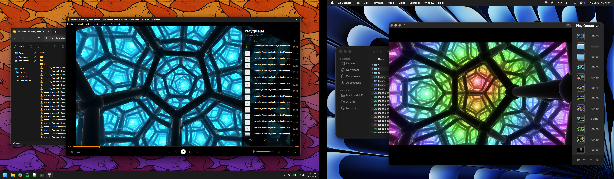

# VJ Curator
Curation is a pain point for VJs. How do you pick out your favorite video clips when going through a VJ pack?

The VJ Curator app is a fork of VLC where you can press the 0-9 hotkeys to easily curate the video clips. After pressing a number key then the video clip will be automatically moved into a folder with a matching number. And since VLC is at its core, it will playback any type of video clip that you give it.


## App for Windows & Mac
**[Download VJ Curator](https://github.com/wivy1/vj-curator/releases/latest)**
- **Note for Windows:** _Download the `.exe`, double-click it, and then click "Run anyway" if the Microsoft Defender SmartScreen pops up. This is a portable build and so you can put the app wherever convenient._
- **Note for MacOS:** _Open the `.dmg`, drag the app somewhere convenient, and double-click it. If the "VJ Curator Not Opened" alert pops up, then open System Settings >>> Privacy & Security >>> scroll to bottom and click "Open Anyway" for VJ Curator. Also since this app moves video clips on its own, you must open System Settings >>> Privacy & Security >>> Accessibility >>> Enable VJ Curator. Now you should be able to use the app as expected._



## Workflow
1. Open the "VJ Curator" app.
2. Drop video clips (or folders) into the queue.
3. Start playing the first video clip.
4. Press any number key on the keyboard (0 through 9).
5. The video clip will be automatically moved into a folder with a matching number. For example, hit "9" on the keyboard and it'll be moved into a folder named "9". Also the video clip will be removed automatically from the queue and the next video starts playing.

## Interpretation of Numbers
The hotkey digits can mean whatever is useful for your curation process. For example...
```
Press "1" for keepers
Press "2" for maybes
Press "3" for rejects
```

## More Details
- There is a counter beside the volume controls which shows how many video clips are left in the queue.
- Drop multiple folders into the queue and the app will automatically index all video clips within the folder.
- Feel free to add video clips into the queue from multiple folders and their original parent directories will always be preserved. During curation, the numbered output folders will be created within each video clip's corresponding parent directory. This makes it easy to work with multiple VJ packs while keeping the resulting curated folders organized within their respective VJ pack locations.
- On the keyboard you can use either the number row keys or numpad keys.
- Video clips are frequently huge and so this app moves the files instead of copying them. Sorry, not sorry.
- Uses the fixed version of VLC which can playback DXV and HAP video clips without crashing.

## Credits
This app is the result of a collaboration between [Will Ivy](https://www.williamivy.com/) and [Jason Fletcher](https://www.jasonfletcher.info/). Vibecoded using ChatGPT Codex 5.5 Thinking Heavy.

VJ Curator is based on VLC media player. VLC media player, VideoLAN, and x264 are registered trademarks of VideoLAN. VJ Curator preserves the VLC licensing and attribution files included in this repository; see `COPYING`, `COPYING.LIB`, `AUTHORS`, `THANKS`, and `README-VLC.md`. VJ Curator is not affiliated with or endorsed by VideoLAN. Much respect to the VLC dev team!
